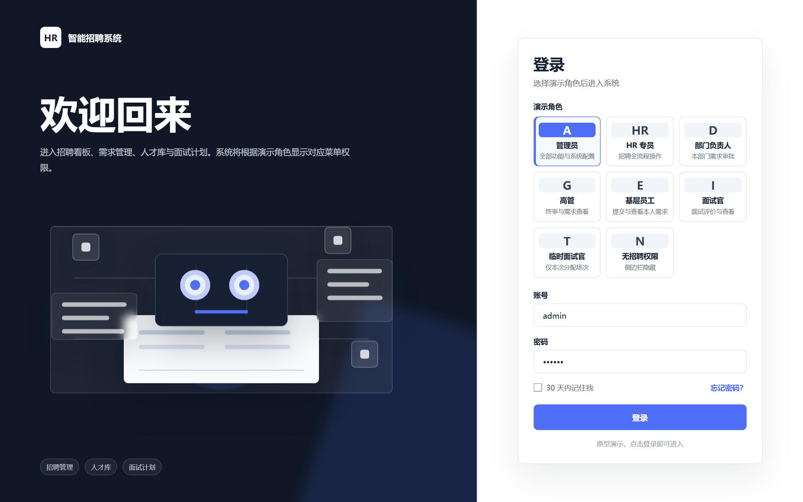
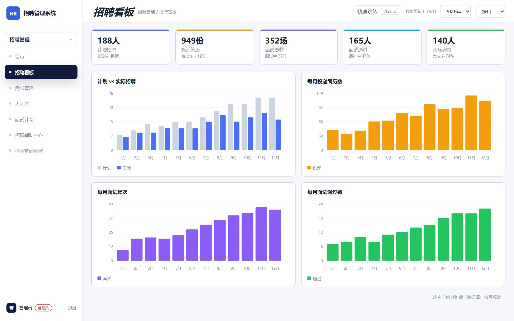
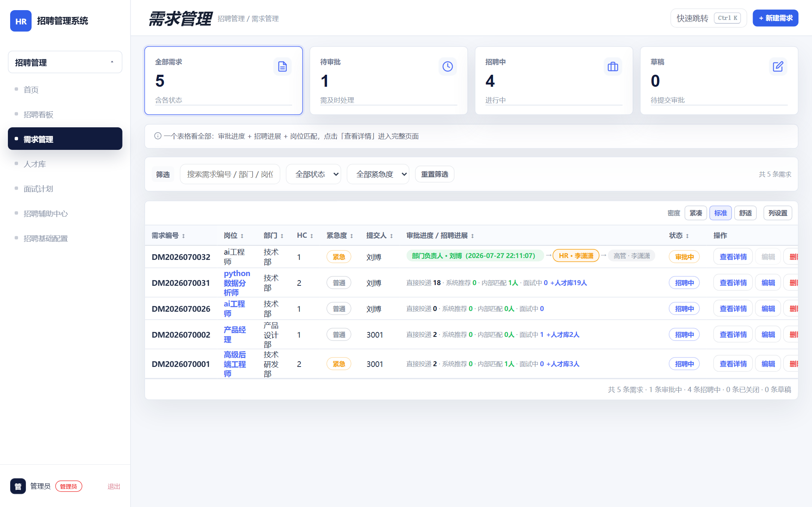
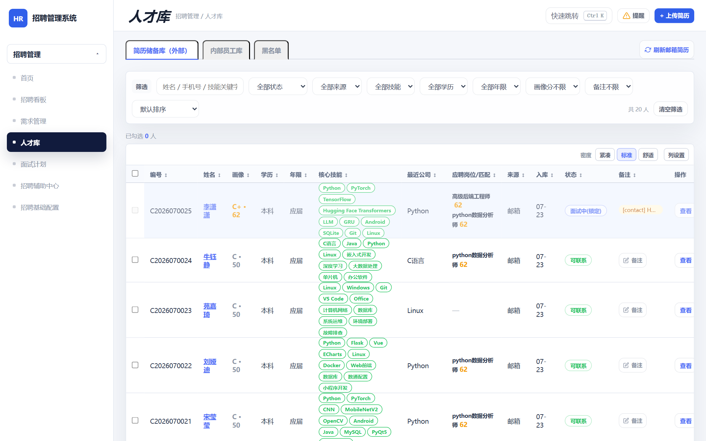
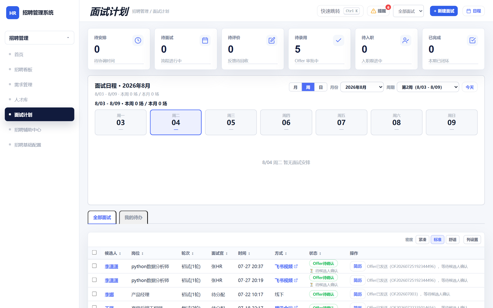
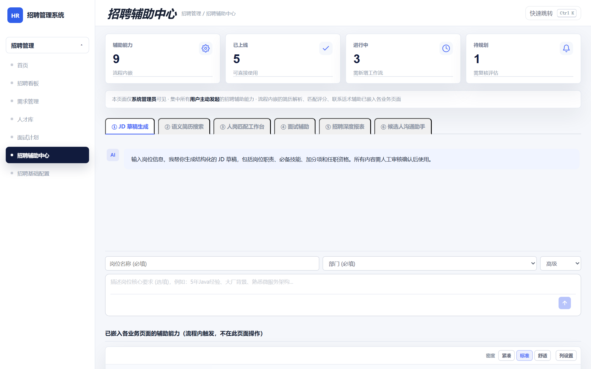
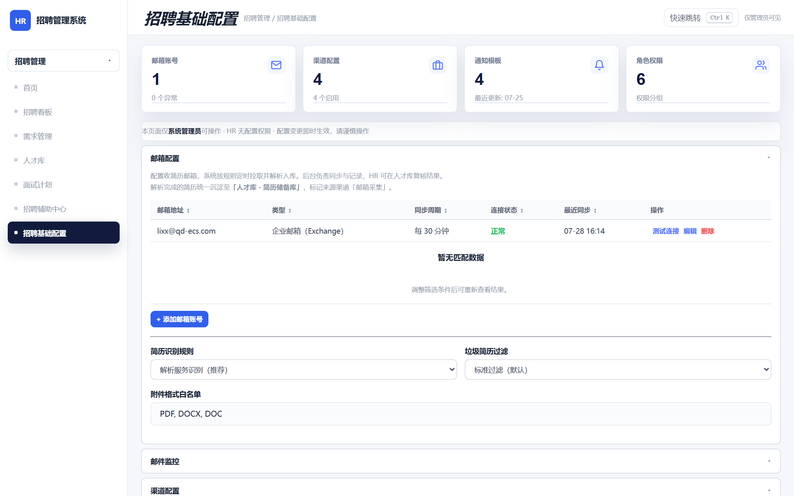

# 智能招聘系统（企业级 HR 招聘平台）

> 覆盖「邮箱收简历 → AI 解析画像 → 人岗匹配 → 面试（飞书/腾讯会议）→ Offer → 入职」全链路的一站式招聘管理平台。
>
> 前端 Vue 3 + Vite，后端 Flask + SQLAlchemy + Celery，AI 由 DeepSeek API 驱动并带本地规则引擎降级兜底。

## 界面预览（Playwright 实采）

以下截图由 `frontend/scripts/capture-readme-shots.mjs` 使用 Playwright 从本地运行中的前后端直接截取，覆盖当前主业务页面。截图输出目录为 `docs/screenshots/`。

### 登录页

Three.js 动态背景，支持管理员、HR、部门负责人、高管、普通员工、面试官、临时面试官和无招聘权限等角色入口。



### 招聘看板

展示招聘目标、投递简历、面试场次、通过人数、到岗人数等 KPI，并提供月度计划/实际招聘、投递、面试、通过趋势图。



### 需求管理

招聘需求列表包含审批进度、招聘进展、紧急度、岗位状态、批量操作和新建需求入口。


### 需求详情

单个岗位展示候选人池、面试推进、待评价、不合适原因、审计关注、需求信息与重新匹配入口。



### 人才库

人才库覆盖外部候选人、内部员工、黑名单、简历处理管道与最近入库记录，支持邮箱收简历、查重合并、联系候选人和发起面试。



### 面试计划

面试计划覆盖待安排、待面试、待评价、Offer、待入职和历史记录，支持预约、评价、发 Offer 与入职推进。



### 招聘辅助中心（AI）

AI 辅助中心统一承载 JD 草稿、语义简历搜索、人岗匹配、面试辅助、招聘深度报表、候选人沟通等能力，支持 DeepSeek 流式输出（SSE）与思考过程可视化。



### 招聘基础配置

基础配置覆盖 API 密钥、邮箱账户、评分规则、招聘渠道、通知模板、会议集成与系统参数，保存后可进行连通性测试。



## 核心功能链路

| 环节 | 能力 |
|------|------|
| 简历采集 | 邮箱 IMAP 定时 + 手动刷新收取附件简历；Boss 直聘 CLI 渠道导入 |
| AI 解析 | DeepSeek 解析简历画像（技能 / 经验 / 教育），本地规则引擎降级兜底 |
| 人岗匹配 | 匹配评分（画像分 / 综合分 / 等级）、待补足技能分析、流式思考过程 |
| 面试 | 飞书视频 / 腾讯会议链接生成、多轮次评价、面试时间线 |
| Offer | 草稿 → 发送 → 接受 / 拒绝 / 过期全状态机；薪资预算校验；重复发送防护（草稿自动复用）；候选人 H5 确认链接邮件 |
| 入职 | Offer 接受后自动创建入职记录，人才库状态联动 |
| 通知 | 面试邀请 / Offer / 入职指引邮件，沟通记录留痕（含审计） |

## 技术栈

| 层 | 选型 |
|----|------|
| 前端 | Vue 3 + Vite + Vue Router + Three.js（登录 / 漏斗 3D 装饰） |
| 后端 | Flask + SQLAlchemy + Celery（异步任务） |
| 数据库 | MySQL / MariaDB（应用运行）；测试环境使用内存 SQLite |
| AI | DeepSeek API + ai_engine 本地规则降级，SSE 流式输出 `/api/ai/stream/*` |
| 集成 | 飞书（视频会议 / 消息）、腾讯会议、Boss 直聘 CLI、IMAP 邮箱 |
| 测试 | Playwright 49 E2E + pytest 37 后端用例 |

## 项目结构

```
hr-web/
├── frontend/               Vue 3 + Vite（9 个页面，10 个 API 模块）
│   ├── src/views/          页面：登录 / 看板 / 需求 / 需求详情 / 人才库 / 面试 / 辅助中心 / 配置
│   ├── src/components/     含 ai/（AiThinking 思考面板、AiConversation 对话组件）等
│   ├── src/api/            后端 API 封装（统一重试 / 缓存 / 错误处理）
│   ├── tests/              Playwright E2E（49 用例）
│   └── scripts/            capture-readme-shots.mjs（README 截图脚本）
├── backend/                Flask 后端
│   ├── app/api/            13 个 Blueprint，96 个 REST 端点
│   ├── app/services/       25 个业务服务（hire / interview / talent / confirm / ai ...）
│   ├── app/models/         31 张表
│   ├── tasks/              Celery 异步任务（邮箱同步等）
│   ├── scripts/            迁移与种子数据脚本
│   └── tests/              pytest（37 用例）
└── docs/                   设计文档与界面截图（docs/screenshots/）
```

## 快速启动

```powershell
# 后端（建议使用 backend/.venv）
cd D:\WorkProject\HrProject\hr-web\backend
.\.venv\Scripts\pip.exe install -r requirements.txt
.\.venv\Scripts\python.exe app.py     # http://127.0.0.1:5000

# 前端
cd D:\WorkProject\HrProject\hr-web\frontend
npm install
npm run dev                           # http://127.0.0.1:7100（/api 代理到 5000）
```

浏览器打开 `http://127.0.0.1:7100/login`，默认账号 `admin / admin123`。

### 运行测试

```powershell
cd D:\WorkProject\HrProject\hr-web\backend
.\.venv\Scripts\python.exe -m pytest tests/ -q

cd D:\WorkProject\HrProject\hr-web\frontend
npx playwright test --workers=2
```

### 重新生成 README 截图

先启动后端 `http://127.0.0.1:5000` 和前端 `http://127.0.0.1:7100`，再运行：

```powershell
cd D:\WorkProject\HrProject\hr-web\frontend
node scripts\capture-readme-shots.mjs            # 输出到 docs/screenshots/
```

## 环境变量（backend/.env）

| 变量 | 说明 |
|------|------|
| `SECRET_KEY` / `JWT_SECRET_KEY` | Flask 与 JWT 签名密钥 |
| `DEEPSEEK_API_KEY` | DeepSeek API Key（缺失时自动降级本地规则引擎） |
| `MOCK_FALLBACK` | 是否允许 mock 兜底（生产应为 `false`） |
| 邮箱 IMAP / 飞书 / 腾讯会议 | 在「招聘基础配置」页面可视化配置，密钥不明文硬编码 |

## 设计原则

- **AI 辅助而非替代**：所有 AI 生成内容带「请人工审核确认后使用」声明；对外联系动作（电话 / 邮件）均由 HR 人工触发，系统只提供话术草稿与字段补齐。
- **真实数据优先**：页面拒绝「虚假按钮」——联系候选人、邮箱刷新、密钥连通性测试等均打通到后端真实能力，失败时明确提示而非静默 mock。
- **幂等交互**：发送 Offer 等关键操作可安全重试（草稿复用），重复提交不会产生脏数据。

## 跟踪文档

| 文件 | 作用 |
|------|------|
| `Memory.md` | 进度记录 + 下一步计划 |
| `Learning.md` | 复盘 + 项目规则 |
| `Wiki.md` | 业务口径 + 架构说明 |
| `Claude.md` | 协作约束（无 emoji 图标 / 无渐变 / 密钥不硬编码等） |
| `README.md` | （本文件）项目概览 |
